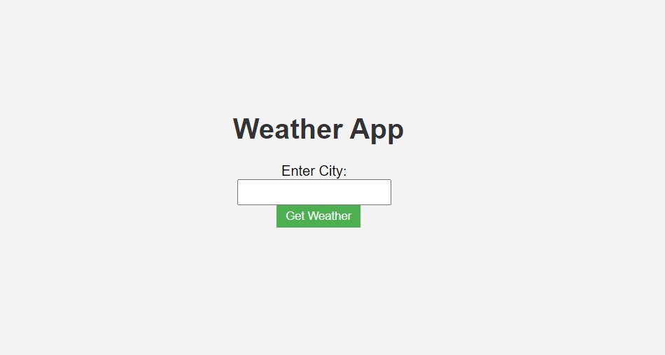

# Weather Finder

This is a simple Weather Finder web application that allows users to get the current weather information for a specific city. It utilizes the OpenWeatherMap API to fetch real-time weather data.

## How to Use

1. Open the `index.html` file in your web browser.
2. Enter the desired city in the input field.
3. Click the "Get Weather" button to retrieve the current weather information.

## Live Demo

Check out the live demo: https://weather-finder-three.vercel.app/

## Features

- **User-Friendly Interface**: The application provides a straightforward interface for users to input a city and get weather details easily.

- **Responsive Design**: The design is responsive, ensuring a seamless experience on various devices.

## Technologies Used

- **HTML**: Structured the web page.
- **CSS**: Styled the page for a visually appealing look.
- **JavaScript**: Implemented functionality to fetch and display weather information.

## Screenshots

## Credits

- OpenWeatherMap API: [https://openweathermap.org/](https://openweathermap.org/)

## License

This project is licensed under the [MIT License](LICENSE).

Feel free to contribute or customize this project according to your needs. If you encounter any issues or have suggestions, please create an issue or submit a pull request.
